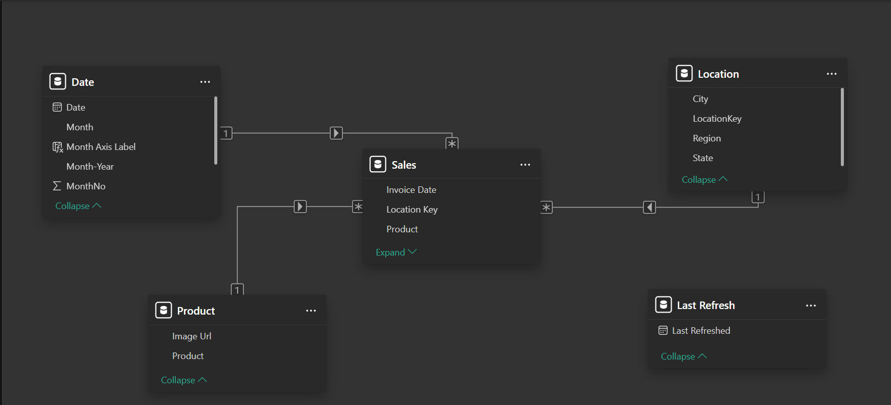

# Adidas Sales Analysis

- [Project Overview](#project-overview)
- [Business Problem](#business-problem)
- [Business Questions](#business-questions)
- [Tools and Skills](#tools-and-skills)
- [Dataset](#dataset)
- [Data Preparation](#data-preparation)
- [Data Modeling](#data-modeling)
- [Dashboard](#dashboard)
- [Key Findings](#key-findings)
- [Recommendations](#recommendations)

## Project Overview
An interactive executive dashboard analysing Adidas' US retail sales performance across products, states, and sales channels for 2020-2021, built to support revenue, profit margin, and retailer performance decisions.

## Business Problem
Adidas leadership needed a consolidated view of sales, profit, and unit performance across products, states, and retail channels to identify which retailers, regions, and product lines were driving growth versus underperforming, since this visibility did not previously exist in one place.

## Business Questions
* Which retailers and sales methods generate the most revenue and the best profit margins?
* Which product categories drive the highest sales, profit, and units sold, and which underperform?
* Which US states and regions contribute the most (and least) to revenue and profit?
* How has monthly revenue and profit trended across the year, and are there seasonal patterns?

## Tools and Skills
* Dashboard design and development.
* KPI card design.
* Interactive slicers/filters (Year, Month, Retailer, Region, Product, Sales Method).
* Data visualisation (line, bar, donut, scatter, and map charts).

## Dataset
[Adidas_Datasets](Adidas_Datasets.xlsx)

## Data Preparation
The raw retailer sales records were structured and modelled so that revenue, profit, and unit figures could be reliably sliced by year, month, retailer, region, state, product, and sales method without manual recalculation.
* Consolidated retailer transaction data into a single model with consistent Revenue, Profit, and Units fields across all retailers and sales methods.
* Standardised state and region names to enable consistent geographic grouping (West, Northeast, Southeast, South, Midwest).
* Calculated Margin % as Profit divided by Revenue for every retailer, product, and state record.
* Derived Average Units per Transaction from Total Units divided by Total Transactions.
* Validated totals (Revenue, Profit, Units, Transactions) against prior-year figures to confirm year-over-year change percentages were accurate.

## Data Modeling

### Data Model Relationships

The model follows a **star-schema structure**, with the **Sales** table serving as the central fact table. It connects to:

* **Date** through `Date`, with a **1-to-many** relationship.
* **Product** through `Product`, with a **1-to-many** relationship.
* **Location** through `Location Key`, with a **1-to-many** relationship.

The **Last Refresh** table is used to store the dashboard’s latest refresh date and is not directly connected to the Sales table.

## Dashboard
The Power BI report provides an interactive view of Adidas sales performance across products, retailers, locations, and sales channels.
### View the Interactive Dashboard

[View the live dashboard here](https://app.powerbi.com/view?r=eyJrIjoiNDhhMTUxYzQtMWRhZi00ZTBiLThiMWItYzY1YTQ3NjExOGYzIiwidCI6IjVmMTEzZjc1LTA2NDMtNGYxOS05MzQwLTMwZGQ0ZDA2MWRkNSJ9)

### Dashboard Pages
#### Sales Overview

#### Product Page

#### Location Page

## Key Findings
* Men's Street Footwear is the standout product line, leading in sales ($208,826,244), profit ($82.80M), and units sold (593,320), showing where product investment is paying off most.
* In-store remains the dominant sales method at 39.63% of revenue ($356.64M), ahead of Outlet (32.85%) and Online (27.52%), indicating physical retail still drives the majority of Adidas sales.
* New York is the top-performing state, generating $64.2M in revenue and $23.3M in profit, while Nebraska is the lowest at $5.9M in revenue, highlighting a wide gap in regional performance.
* Sports Direct posts the strongest retailer margin (40.74%) despite not being the top revenue generator, while overall blended margin sits at 36.9%, suggesting margin and revenue leadership don't always align by retailer.
* The West region leads all regions in revenue at $269.9M, followed by Northeast ($186.3M), Southeast ($163.2M), South ($144.7M), and Midwest ($135.8M), showing a clear geographic concentration of sales.

## Recommendations
* Increase inventory and marketing investment in Men's Street Footwear given its leading sales, profit, and unit volume.
* Investigate why Women's Athletic Footwear underperforms (lowest product sales at $106,631,896) and consider a targeted pricing or promotional review.
* Study Sports Direct's higher-margin model (40.74%) for practices that could be applied to lower-margin retailers like Walmart (34.58%).
* Prioritize growth initiatives in the West and Northeast regions while investigating why states like Nebraska lag well behind top performers such as New York.
